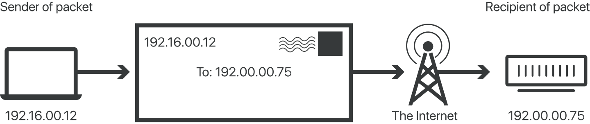
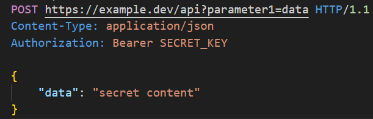
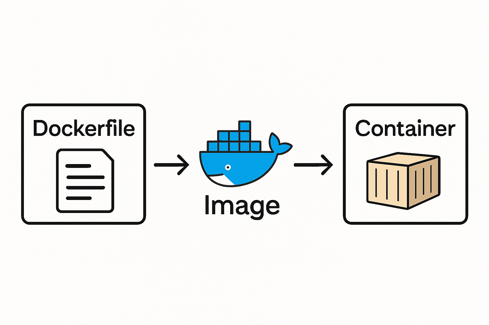
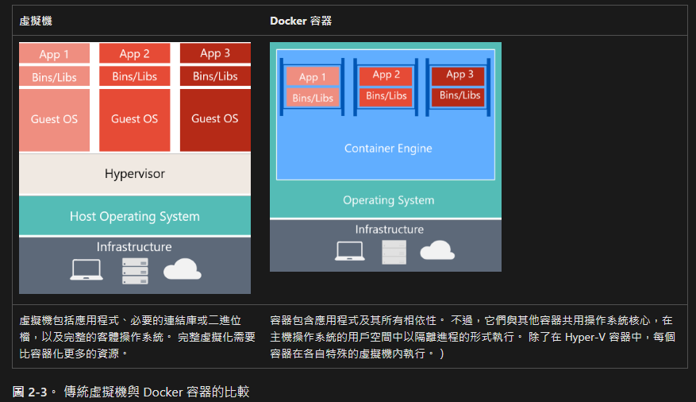

# Introduction to Network Engineering

Phate

----

## Concept from

- [alex/what-happens-when](https://github.com/alex/what-happens-when)
- [vasanthk/how-web-works](https://github.com/vasanthk/how-web-works)

---

## Network Engineering

----


----

### What is Network Engineering?



Note:
網路要處理的就是如何把封包轉交
source to destination
要知道資料送出後被目的端主機接收中間會發生甚麼事，對於應用開發雖然不需要知道每一層的細節，但是除錯時會有概念

----

### OSI or TCP/IP Model


Note:
ISO OSI 7 layers model 較早提出但過於太繁瑣，一般比較會用 TCP/IP model 定義來處理問題

HTTP/3 中 Google 提出的 QUIC 協定使用 UDP 取代 TCP 。

舉例使用手機在通訊軟體聊天室中輸入字串按下送出，使用 HTTPS 協定在 presentation layer 用公鑰加密，用 DNS 查詢 IP 後加入封包，最後用 Wifi 丟給 router 。 Router 判斷封包決定收下轉到內網或是丟給下一跳的 router ，到目的地主機假設使用有線網路，走 ethernet 收下封包，用私鑰解開，展示訊息在螢幕上。

----

- Presentation or Session layer
  - SSL, TLS (HTTPS)
- Network layer
  - IP, ICMP
  - Router
- Data link layer
  - Ethernet, PPP
  - Switch vs. Hub: [What's the difference?](https://www.facebook.com/reel/3613987085575154)
- Physical layer
  - Cables, Hubs

Note:
PTT 早期使用沒加密的 telnet ，目前已經改用 Websocket 和 SSH
<https://www.imperva.com/learn/application-security/osi-model/>

----

### Network Topology


Note:
「拓樸」是指網路中各節點（設備）之間的連線方式，而不是特定的實體環境。
Ring 環狀拓樸例如， EXO Labs 利用 thunderbolt 把 mac mini 串聯叢集，thunderbolt 是 Intel 開發的 P2P 連線標準，所以機器之間是透過多個埠串聯成一圈。
Mesh 像如果大坪數房間，會使用多個 Wifi AP 來確保信號覆蓋提高可用性。
Star 星狀拓樸較常見，舉例來說我們開發一個應用服務容器會接上 DB 容器存資料，同時也會另外接上 Redis 容器快取。
當要設計一個系統時，了解資料會怎麼傳遞很重要。像環狀拓樸，只要單一段連線頻寬低效就會影響整體的效能。星狀拓樸可能遇到程式有 bug 單點故障整個服務就掛掉，那要如何設計備援機制可以橫向擴充

---

### Debugging

----

#### Ping [Pong]

```shell
$ ping -c 4 google.com
PING google.com (142.250.66.78) 56(84) bytes of data.
64 bytes from hkg12s27-in-f14.1e100.net (142.250.66.78): icmp_seq=1 ttl=111 time=12.4 ms
64 bytes from hkg12s27-in-f14.1e100.net (142.250.66.78): icmp_seq=2 ttl=111 time=12.7 ms
64 bytes from hkg12s27-in-f14.1e100.net (142.250.66.78): icmp_seq=3 ttl=111 time=11.5 ms
64 bytes from hkg12s27-in-f14.1e100.net (142.250.66.78): icmp_seq=4 ttl=111 time=9.40 ms

--- google.com ping statistics ---
4 packets transmitted, 4 received, 0% packet loss, time 3005ms
rtt min/avg/max/mdev = 9.399/11.529/12.724/1.304 ms
```

Note:
ICMP 主要用來做網管的協定，像是 ping 和 traceroute 都是使用 ICMP 協定來傳送封包。
PING 的問題是能提供的資訊有限制，而且有時候會被防火牆阻擋。

----

#### Traceroute

```shell
$ traceroute google.com
traceroute to google.com (142.250.66.78), 30 hops max, 60 byte packets
 1  AllNewPCII.mshome.net (172.27.32.1)  0.188 ms  0.169 ms  0.156 ms
 2  192.168.0.1 (192.168.0.1)  0.887 ms  0.538 ms  0.862 ms
 3  dsldevice.lan (192.168.1.254)  4.975 ms  5.864 ms  6.860 ms
 4  * * *
 5  192.168.41.245 (192.168.41.245)  10.844 ms  10.822 ms  10.812 ms
 6  GANGDU-X68-2-PO2-VIP.IX.homeplus.net.tw (203.133.92.173)  24.941 ms  21.377 ms  21.356 ms
 7  CL-BR93-2-PO13-GANGDU.IX.kbtelecom.net (203.187.23.241)  24.155 ms  18.970 ms CL-BR93-1-PO3-GANGDU.kbtelecom.net (203.187.22.254)  18.972 ms
 8  TPNOC1-SC93-VL714-CLINGLIAN.IX.kbtelecom.net (203.187.6.45)  20.623 ms  12.893 ms TPNOC1-MKII-SC93-VL734-CHINGLIAN.IX.kbtelecom.net (203.187.9.253)  31.806 ms
 9  TPNOC1-P93-2-ETH1-49-SC93.IX.kbtelecom.net (203.187.6.130)  41.719 ms TPNOC1-P93-2-ETH1-51-MKII-SC93.kbtelecom.net (203.187.6.138)  29.933 ms *
10  * * CHIEF-P93-2-PO86-TPNOC1.IX.kbtelecom.net (203.187.9.66)  35.356 ms
11  72.14.213.145 (72.14.213.145)  39.320 ms 72.14.216.61 (72.14.216.61)  38.331 ms *
12  192.178.105.193 (192.178.105.193)  33.237 ms * *
13  142.251.226.168 (142.251.226.168)  21.072 ms 209.85.243.197 (209.85.243.197)  18.015 ms 209.85.245.65 (209.85.245.65)  28.555 ms
14  hkg12s27-in-f14.1e100.net (142.250.66.78)  27.444 ms 192.178.106.166 (192.178.106.166)  35.437 ms 209.85.243.197 (209.85.243.197)  12.452 ms
```

- [台灣海纜動態地圖](https://smc.peering.tw/), [liheng_yu](https://www.threads.com/@liheng_yu/post/DLKOzp7piwJ)

----

#### IP Address

```shell
$ ip addr
1: lo: <LOOPBACK,UP,LOWER_UP> mtu 65536 qdisc noqueue state UNKNOWN group default qlen 1000
    link/loopback 00:00:00:00:00:00 brd 00:00:00:00:00:00
    inet 127.0.0.1/8 scope host lo
       valid_lft forever preferred_lft forever
    inet 10.255.255.254/32 brd 10.255.255.254 scope global lo
       valid_lft forever preferred_lft forever
    inet6 ::1/128 scope host
       valid_lft forever preferred_lft forever
2: eth0: <BROADCAST,MULTICAST,UP,LOWER_UP> mtu 1500 qdisc mq state UP group default qlen 1000
    link/ether 00:15:5d:64:7a:c2 brd ff:ff:ff:ff:ff:ff
    inet 172.27.43.151/20 brd 172.27.47.255 scope global eth0
       valid_lft forever preferred_lft forever
    inet6 fe80::215:5dff:fe64:7ac2/64 scope link
       valid_lft forever preferred_lft forever
$ ip route
default via 172.27.32.1 dev eth0 proto kernel
172.27.32.0/20 dev eth0 proto kernel scope link src 172.27.43.151
```

- [Wireshark](https://www.wireshark.org/)

----

#### server bind address

```shell
Usage: uvicorn [OPTIONS] APP

Options:
  --host TEXT    Bind socket to this host. [default: 127.0.0.1]
```

Why is it always 0.0.0.0?

---

### HTTP Debugging

- Status codes
  - 1xx: hold on
  - 2xx: here you go
  - 3xx: go away
  - 4xx: you fucked up
  - 5xx: I fucked up

----

- cURL

```shell
$ curl -I https://www.google.com
HTTP/2 200
```

- [HTTP Cats](https://http.cat/), [HTTP Status Dogs](https://http.dog/)
- [MDN Web Docs](https://developer.mozilla.org/en-US/docs/Web/HTTP/Reference/Status)
- [人人都需要一個 HTTP proxy 來 debug](https://blog.huli.tw/2025/04/23/everyone-need-a-http-proxy-to-debug/), [mitmproxy](https://mitmproxy.org/)

----

### Question

Which parts of an HTTPS request are encrypted?



----

### Answer


- request line (method, path, parameters)
- headers
- body
- DNS? DoH, DoT
- [HTTP Wiki](https://en.wikipedia.org/wiki/HTTP#Request_syntax)

----

### Some References

- [How to Become a Network Engineer in 2025!](https://youtu.be/0akMyLijNVg)
- [什麼是 OSI 模型？](https://www.cloudflare.com/zh-tw/learning/ddos/glossary/open-systems-interconnection-model-osi/)
- [OSI 七層架構和 TCP/IP 通訊協定的比較](https://hackmd.io/@Pang-Chang/BkQK8_tjF)
- [什麼是網際網路通訊協定？](https://www.cloudflare.com/zh-tw/learning/network-layer/internet-protocol/)
- [企業資料通訊Week4 (3) | HTTP message](https://ithelp.ithome.com.tw/articles/10282071)

---

## Containerization

- OpenVZ 2005 --> Process Container 2006
- LXC 2008 --> Docker 2013 --> K8S 2014 --> OCI 2015

----



----



----

- [为什么程序员都应该学用容器技术](https://youtu.be/ytOW5t-iYP8)

> 覺得變麻煩的人，純粹只是以前跳過很多應該做好的本職工作

---

## Live Demo

---

## Afterword

- [reveal.js](https://revealjs.com/), [GitHub repo](https://github.com/hakimel/reveal.js)
- [Plugins, Tools and Hardware](https://github.com/hakimel/reveal.js/wiki/Plugins,-Tools-and-Hardware)
- [Reveal.js-plugins](https://github.com/rajgoel/reveal.js-plugins/)
